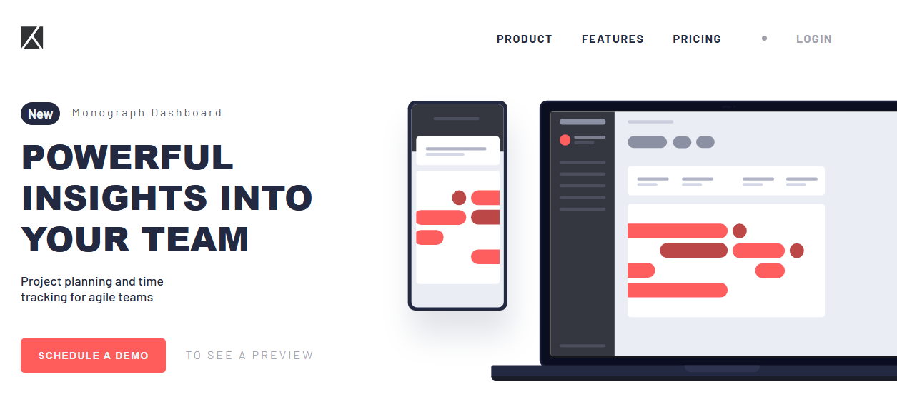

# Project Tracking Intro Component

A responsive and modern landing page section for project tracking and team insights, built as part of a Frontend Mentor challenge.

## Overview

This project is a solution to the [Frontend Mentor Project Tracking Intro Component challenge](https://www.frontendmentor.io/challenges/project-tracking-intro-component-5d289097500fcb331a67d80e).

It showcases a hero section with:

- Responsive layout for desktop and mobile
- Interactive buttons and hover effects
- Modern typography and clean visuals
- Devices illustration for project context

### Screenshot

### Links

- Solution URL: [GitHub Repository](https://github.com/BahaaMedhat1/Project-Tracking-Intro-Component)
- Live Site URL: [Live Demo](https://bahaamedhat1.github.io/Project-Tracking-Intro-Component/)

### Built With

- Semantic HTML5
- CSS Custom Properties (Variables)
- Flexbox
- CSS Grid
- Mobile-first workflow
- Vanilla JavaScript for share menu toggle

### What I Learned

- How to structure a responsive card component with CSS Grid and Flexbox.
- Using CSS variables to maintain consistent colors and typography.
- Creating a toggleable share menu with JavaScript.
- Handling responsiveness and media queries for small screen devices.

## Author

- Frontend Mentor - [@BahaaMedhat1](https://www.frontendmentor.io/profile/BahaaMedhat1)
- GitHub - [BahaaMedhat1](https://github.com/BahaaMedhat1)
- LinkedIn - [Bahaa Wanas](https://www.linkedin.com/in/bahaa-wanas-9797b923a)
